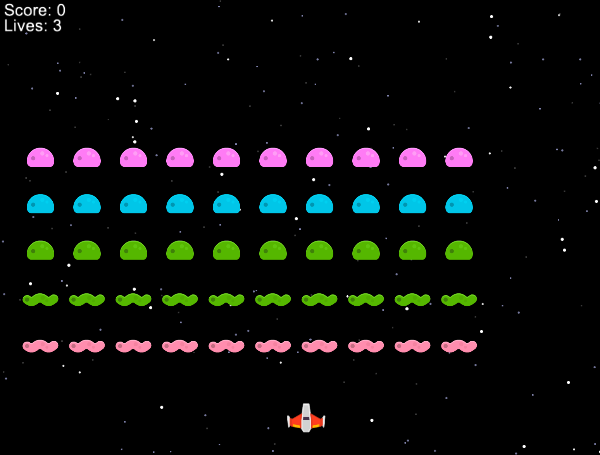

# Invaders

A Space Invaders clone built with Python and the Arcade library.



## AI

Generated 100% with GLM-5 and Droid:
- 112592 tokens
- 245 requests
- nano-gpt $8 subscription (60k requests/month, max context length)

## Features

- Classic Space Invaders gameplay
- Sprite-based graphics with Kenney assets
- Explosion animations
- Sound effects
- Parallax starfield background
- Fullscreen support with proper scaling
- Lives and score system

## Requirements

- Python 3.14+
- Arcade 3.3+

## Installation

```bash
# Clone the repository
git clone https://github.com/uv-genai/invaders-glm5.git
cd invaders-glm5

# Create virtual environment
uv venv

# Install dependencies
uv pip install -e ".[dev]"
```

## Running the Game

```bash
uv run invaders
```

## Controls

| Key | Action |
|-----|--------|
| Left / A | Move left |
| Right / D | Move right |
| Space | Fire |
| F | Toggle fullscreen |
| R | Restart (after game over) |

## Gameplay

- Destroy all aliens before they reach the bottom
- You have 3 lives
- Each alien destroyed awards 10 points
- Win by destroying all aliens
- Lose if aliens reach the bottom or you run out of lives

## Development

### Code Quality

```bash
uv run ruff format .
uv run ruff check .
uv run mypy src/
```

### Testing

```bash
uv run pytest tests/ -v
```

## Assets

All sprites and sounds are from [Kenney.nl](https://kenney.nl/) via Arcade's built-in resources (CC0 license).

## License

MIT
